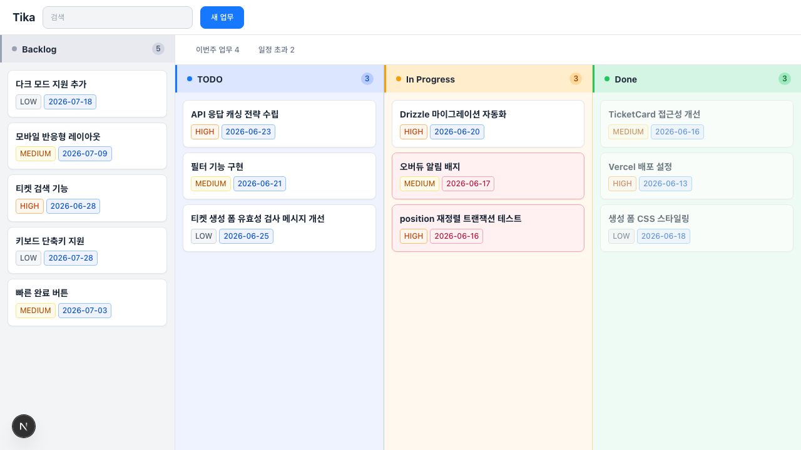

# Tika

티켓 기반 칸반 보드 TODO 앱

## 개요

Tika는 할 일을 티켓 단위로 등록하고 드래그 앤 드롭으로 진행 상태를 관리하는 칸반 보드 앱이다.  
Backlog / TODO / In Progress / Done 4개의 고정 컬럼으로 구성되며, 단일 사용자 환경을 전제로 한다.



## 기능

- **티켓 CRUD** — 제목, 설명, 우선순위(LOW/MEDIUM/HIGH), 계획시작일, 종료예정일
- **드래그 앤 드롭** — 컬럼 간 이동 및 같은 컬럼 내 순서 변경
- **자동 날짜 추적** — TODO 이동 시 `startedAt`, Done 이동 시 `completedAt` 자동 기록
- **오버듀 표시** — `dueDate < 오늘 AND status ≠ DONE` 조건의 티켓 시각적 표시
- **Done 필터** — 완료 후 24시간 이내 티켓만 Done 칼럼에 표시

## 기술 스택

| 분류 | 기술 |
|------|------|
| Framework | Next.js 15 (App Router) |
| Language | TypeScript (strict) |
| Frontend | React 19, Tailwind CSS 4 |
| Drag & Drop | @dnd-kit/core + @dnd-kit/sortable |
| ORM | Drizzle ORM |
| DB | Vercel Postgres (Neon) |
| Validation | Zod |
| Testing | Jest + React Testing Library |
| Deployment | Vercel |

## 프로젝트 구조

```
app/api/tickets/
├── route.ts              # GET /api/tickets, POST /api/tickets
├── reorder/route.ts      # PATCH /api/tickets/reorder
└── [id]/
    ├── route.ts          # GET·PATCH·DELETE /api/tickets/:id
    └── complete/route.ts # PATCH /api/tickets/:id/complete

src/
├── server/
│   ├── db/
│   │   ├── index.ts      # Drizzle 인스턴스
│   │   └── schema.ts     # tickets 테이블 스키마
│   └── services/
│       └── ticketService.ts
├── client/
│   ├── api/ticketApi.ts  # API 호출 레이어
│   ├── components/       # React 컴포넌트
│   └── hooks/
└── shared/
    ├── types/index.ts    # 공유 타입
    └── validations/      # Zod 스키마
```

## 아키텍처 원칙

- `src/client` ↔ `src/server` 간 직접 import 금지. `src/shared`를 통해서만 공유
- DB 접근은 `src/server/` 에서만
- Route Handler는 요청 파싱 → 서비스 호출 → 응답 반환만 담당

## 문서

- [PRD](docs/PRD.md) — 제품 요구사항
- [TRD](docs/TRD.md) — 기술 요구사항
- [API 명세](docs/API_SPEC.md)
- [데이터 모델](docs/DATA_MODEL.md)
- [컴포넌트 명세](docs/COMPONENT_SPEC.md)
- [디자인 시스템](docs/DESIGN_SYSTEM.md)
- [테스트 케이스](docs/TEST_CASES.md)
